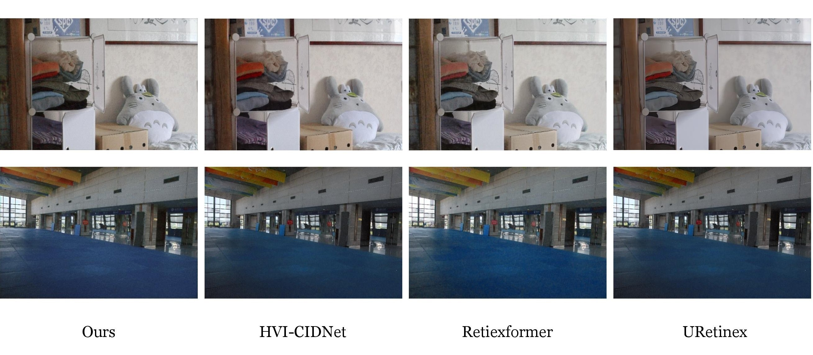

&nbsp;
# LLEN-SLAM
基于弱光增强的SLAM

> updatetime : 2024/8/19 23:00

## 💡 News 新闻


- **2024.08.19** The initial model was completed, and compared with different low-light models, the effect was only 20.9. Other models were tested simultaneously (avg:21.5), with a difference of 0.6 points.
- **2024.08.08** project startup 🎈


## ⚙ module 模型组件


## 🖼 Visual Comparison 视觉比较




## 🧾 Weights and Results 

### Ours

| Folder (test datasets)                        | PSNR        | SSIM       | LPIPS      | GT Mean | Results                                                      | Weights Path             |
| --------------------------------------------- | ----------- | ---------- | ---------- | ------- | ------------------------------------------------------------ | ------------------------ |
| (LOLv1)<br />v1        | 20.9049     |  0.7718    | **   **    |         |   | LOLv1/net_g_1500.pth         |

### Compare LOLv1 datasets

It should be noted that the following assessment is not fine-tuned and is conducted directly after training.

|   Model name       | PSNR        | SSIM        | LPIPS      | GT Mean    | Results | Weights Path             |
| --------------------------------------------- | ----------- | ---------- | ---------- | ------- | ----------------------------------------- | ------------------------ |
| **Ours_v1**        | 20.9049     |  0.7718    |   X         |    X       |    -    | LOLv1/net_g_1500.pth         |
| HVI-CIDNet       	 | 21.61       |  0.793     | 0.217       |     X      |    -    |  LOLv1\My_model\epoch_best.pth  |
| retinexformer      | 21.798      |  0.802     | X           |      X     |     -   |  LOLv1\My_model\best_psnr_21.96_27000.pth  |
| URetinex-Net       | 21.32(Official) |     X      | X           |      X     |     -   |  LOLv1\Official_model\ckpt  |
| GlobalDiff       | 27.625|     0.874      | 0.0912           |      X     |     -   |  ~~LOLv1\My_model~~  |
| KinD       | X |     X      | X           |      X     |     -   |  ~~LOLv1\My_model~~  |
| KinD++       | X |     X      | X           |      X     |     -   |  ~~LOLv1\My_model~~  |

## 🌑 0. My environment

- Ubuntu 20.04.6
- AMD R9 5900HX
- RTX 3080 Laptop 16G
- RAM 32G

## 🌑 1. Get Started 

- Python 3.7.0
- Pytorch 1.11.1

(1) Create Conda Environment

```bash
conda create --name LLEN python=3.7.0
conda activate LLEN
```

(2) Clone Repo

```bash
git clone https://github.com/suiuko/LLEN-SLAM.git
```

(3) Install Dependencies

```bash
cd LLEN-SLAM
pip install -r requirements.txt
```

### Data Preparation

Currently only the LOLv1 database is tested

- [LOLv1](https://daooshee.github.io/BMVC2018website/)

<details open> <summary>datasets (click to expand)</summary>
  
```
├── datasets
	├── DICM
	├── LIME
	├── LOLdataset
		├── our485
			├──low
			├──high
		├── eval15
			├──low
			├──high

```
</details>

## 🌒 2. Testing 

## 🌒 3. Training  

```bash
# activate the enviroment
conda activate LLEN

# LOL-v1
python3 basicsr/train.py --opt Options/LOL_v1.yml

```
