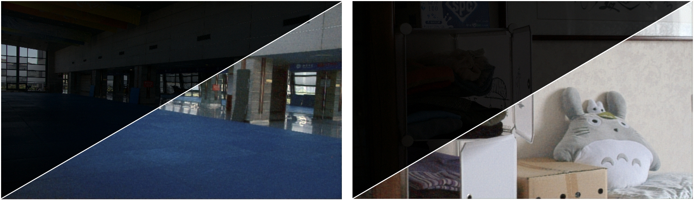
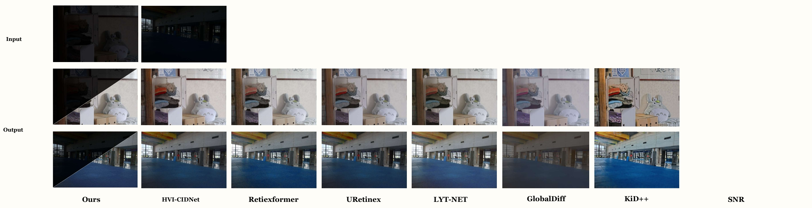

&nbsp;
# LLEN-SLAM
基于弱光增强的SLAM




## 💡 News 新闻

- **2024.09.26** V2.3 on Epoch 370/1500, have PSNR: 28.329210, SSIM: 0.877992 on LOL_v2
- **2024.09.23** V2.1.1 version in epoch150, PSNR:25.5085, SSIM:0.8311 on LOL_v1
- **2024.09.21** V2.0-6variate version in epoch150, PSNR:25.429, SSIM:0.8292
- **2024.09.18** V1.5 version in epoch150, PSNR:25.39
- **2024.09.15** V1.4 version in epoch150, PSNR:24.97, SSIM:0.811
- **2024.09.03** 🌟 The first version completed training and testing, PSNR: 25.441431, SSIM: 0.824064. The input conversion to LAB is done in this version. Good results were achieved.
- **2024.08.19** The initial model was completed, and compared with different low-light models, the effect was only 20.9. Other models were tested simultaneously (avg:21.5), with a difference of 0.6 points.
- **2024.08.08** project startup 🎈


## ⚙ module 模型组件


## 🖼 Visual Comparison 视觉比较




## 🧾 Weights and Results 

### Ours

| Folder (test datasets) | PSNR       	 | SSIM       | LPIPS      | Results       | Weights Path             |
| ------------------ | -----------		 | ---------- | ---------- 	| ------- 		| ----------- | 
| (LOLv1)<br />v1    | 25.441431    	 |  0.824064   | ** |  **    |          | LOLv1.pth         |
| (LOLv2)<br />v2    | 28.329210    	|  0.877992   | **  | **    |          | LOLv2.pth         |

### Compare LOLv1 datasets

It should be noted that the following assessment is not fine-tuned and is conducted directly after training.

|   Model name       | PSNR        | SSIM        | LPIPS        | 			Weights Path       |
| ------------------ | ----------- | ---------- | ----------  | ------------------------ |
| **Ours_v1**        | 25.441431   	  |  0.824064   	 |   X         | LOLv1/net_g_1500.pth         |
| HVI-CIDNet       	 | 21.61     	  |  0.793   		  | 0.217        |  LOLv1\My_model\epoch_best.pth  |
| retinexformer      | 21.798    	  |  0.802   		  | X            |  LOLv1\My_model\best_psnr_21.96_27000.pth  |
| URetinex-Net       | 21.32(Official) |     X     		 | X             |  LOLv1\Official_model\ckpt  |
| GASD     	 		 | 26.232 			|  0.8519    	 |   X  			  |  ~~LOLv1\My_model~~  |
| LYT—NET     		 | 25.4462 			|   0.8307  	  | X         		   |  ~~LOLv1\My_model~~  |
| KinD++     		  |  15.6506		|     0.5079      | 0.2555             |  ~~LOLv1\My_model~~  |
| Diffusion Low Light   |  21.651		|     0.8056      | 0.1768            |  ~~LOLv1\My_model~~  |


You can get pth on [Google drive](https://drive.google.com/drive/folders/1L7V2KOsgav5qFgU4CzwiNcC_OBz2OeQK?usp=sharing)
### Compare LOLv1 datasets official numerical value

|   Model name       | PSNR        | SSIM        | LPIPS      | 
| ----------------- | ----------- | ---------- | ---------- |
| **Ours_v1**        | 20.9049   	  |  0.7718    |   X         |  
| HVI-CIDNet       	 | 23.500     	  |  0.8703     | 0.1053       | 
| retinexformer      | 25.154    	  |  0.8445     | X           |  
| URetinex-Net       | 21.32 		|     X     	 | X           | 
| GSAD     	 		 | 27.623		|  0.874    	 |   0.0912    |  
| LYT—NET      		 | 26.6280 		|   0.8349   	 | X           |   
| KinD++     		  |  X 			|    X    		 |     X   |   
| Diffusion Low Light   |  26.047	|     0.8445      | 0.1184   |  

### Training log
|   Model name      |           comment			 |  
| ----------------- | ------------------------   |
| **Ours_v1**       |    epoch:1500    			|     
| **Ours_v2**       |    epoch:1500    			|    
| HVI-CIDNet       	|    epoch:1000    			|    
| retinexformer     |     epoch:683 & iter:41K   |   
| URetinex-Net      |     -   					|   
| GSAD     	|    First training 1000K;Second training 2000K    |    
| LYT—NET    		|     epoch:1500  		|    
| KinD++     		|  			-			    |  


### check log

Log files are stored in `./Compare_models/ different models/ LOLv1/info`

## 🌑 0. My environment

- Ubuntu 20.04.6
- AMD R9 5900HX
- RTX 3080 Laptop 16G
- RAM 32G

## 🌑 1. Get Started 

- Python 3.9
- pytorch-cuda=11.8

(1) Create Conda Environment

```bash
conda create --name LLEN python=3.9 -y
conda activate LLEN
```

(2) Clone Repo

```bash
git clone https://github.com/suiuko/LLEN-SLAM.git
```

(3) Install Dependencies

```bash
cd LLEN-SLAM
pip install -r requirements.txt
```

### Data Preparation

Currently only the LOLv1 database is tested

- [LOLv1](https://daooshee.github.io/BMVC2018website/)

<details open> <summary>datasets (click to expand)</summary>
  
```
├── datasets
	├── DICM
	├── LIME
	├── LOLdataset
		├── Train
			├──low
			├──high
		├── Test
			├──low
			├──high

```
</details>

## 🌒 2. Testing 

## 🌒 3. Training  

```bash
# activate the enviroment
conda activate LLEN

# LOL-v1
python3 train.py 

```
